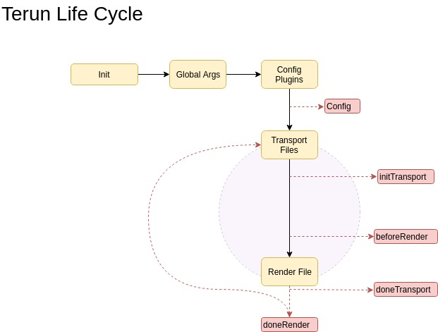

# Ciclo de vida

O ciclo da vida do terun é importante para saber o que é disponibilizado em cada passo da vida do fluxo de execução.

Antes de renderizar um arquivo os plugins irão trabalhar nos argumentos (passo "beforeRender") disponibilizados ou até mesmo nas configurações definidas por eles mesmos para injetar mais conteúdo nas variáveis que serão dadas no passo "Render File" para finalmente renderizar os arquivos.