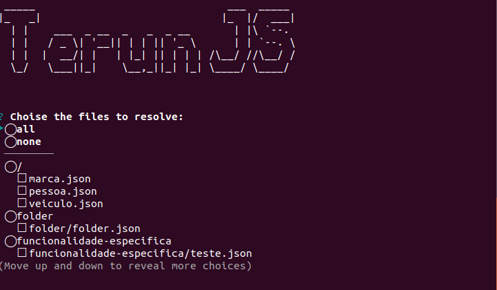

# Plugins

Plugins são utilizados pelo terun para extender funcionalidades e disponibilizar aos templates mais variáveis.

## Utilizando

Depende do plugin, apenas o nome será obrigatório pois como ele é único, será utilizado pra inicia-lo.

Isto é colocado DENTRO do arquivo de configuração do terun, dentro do comando que quiser.

```
"plugins": [
    {
        "name": "nome_do_plugin",
    }
]
```

## Symfony

```json
{
   "plugins": [
        {
            "name": "symfony:entity-form",
            "from": "entity/>>entity<<Entity.php"
        }
    ]
}
```

### Será disponibilizado as seguintes variáveis aos templates:

|propriedade| ação|
|----------|-----|
|symfony-form-builder|Retorna uma string com o formulário do symfony|
|symfony-entity-props|Retorna um array das propriedades da entidade|
|symfony-entity-get-entity-print-codes|Retorna um array da entidade e sua propriedade como `usuario.id` em vez de só `id`|
|symfony-entity-props-counter|Contador das propriedades|
|s:class_lower|Classe string minúscula|
|s:class_cap|Classe em string capitalize `agente vai para Agente`|
|s:class_plural_lower|`s:class_lower` só que no plural|
|s:class_plural_cap|`s:class_cap` só que no plural|


## Entity

```json
{
    "plugins": [
        {
            "name"    : "entity",
            "entity_dir" : "entitys",
            "field":{
                "dir" : "fields",
                "extension": "html"
            }
        }
    ]
}
```

O plugin de entity trabalha com arquivos para especificar objetos que serão utilizados.

> Exemplo: Preciso criar os objetos de Carro.js, Marca.js e Pessoa.js. Então seráo criadas 3 entidades que serão utilizadas pra criar estes três arquivos com tudo definido.

```
project
|   README.md
|___terun (optional)
|   |  terun.default.json
|   |__templates
|   |   | classe.html
|   |   | formulario.html
|   |__entitys
|   |   | pessoa.json
|   |   | veiculo.json
|   |   | marca.json
|   |   | ...
|   |__config
|   |   | fields.json
|   |__fields
|   |   | text.html
|   |   | boolean.html
|   |   | hasMany.html
|   |   | ...
```

### Configurando:

|propriedade| para que serve|
|----------|-----|
|schema|é o esquema da entidade, definindo nomes, atributos e etc|
|config|define configurações para a entidade|

Dentro do schema:

|propriedade| para que serve|
|----------|-----|
|name|Nome da entidade|
|custom|Define atributos customizados para serem utilizados dentro dos templates|
|attributes|Define atributos dentro de uma entidade|

```json
// Pessoa.json

{
    "schema":{
        "name":"Pessoa",
        "custom":{
            "dbname":"PESSOA",
            "alias":"PS",
            "qualquer_atributo":"MEU ATRIBUTO"
        },
        "attributes":{
            "NOME":{
                "type":"text",
                "required":true,
            },
            "IDADE":{
                "type":"number"
            },
            "SOLTEIRO":{
                "type":"boolean"
            },
            "DATA_ATUALIZACAO":{
                "type":"date"
            },
            "EXCLUIDO":{
                "type":"number"
            },
            "CARROS":{
                "reference":"Veiculos|hasMany"
                //Nome do arquivo Veiculos.json que está dentro da pasta entitys
            }
        }
    }
}
```

### Será disponibilizado as seguintes variáveis aos templates:

|propriedade| ação|
|----------|-----|
|entity:name|Nome da entidade `schema.name`|
|entity:forms|Array dos campos renderizados lá no fields `provenientes da pasta fields`|
|entity:files|Array de arquivos de entidades (apenas o nome) `arquivos dentro de entitys`|
|entity:entitys_config|Array de configuração de entidades (conteúdo) `arquivos dentro de entitys`|
|entity:references|Array de referencia da entidade `no caso da pessoa ela tem carros como referencia`|
|entity:attributes|Array de atributos com seus parametros `schema.attributes`|
|entity:custom|Propriedades do objeto custom da entidade definida `schema.custom`|


### Explain das propriedades retornadas
> Está sendo utilizado como exemplo o arquivo de configuração Pessoa.json que está acima.

| função | retornos |
|----------|-----|
| entity:attributes | (name, type, options `options são os atributos customizaveis`) |


### Utilizando fields

Muito importante adicionar isto no plugin. Onde os arquivos de field estarão dentro da pasta `fields` na extenção `html`.

```json
"field":{
    "dir" : "fields",
    "extension": "html"
}
```

Dentro da pasta config existe um arquivo chamado `fields.json`

```json
{
  "defaultValues":{
    "required":true
  }
}
```

No momento existe apenas a propriedade de `defaultValues` onde é possível definir valores default (caso não existam) dentro das propriedades. Onde todos os atributos teriam a propriedade `required:true` disponível dentro arquivo de fields.


### Tree view

Utilize as pastas pra criar agrupadores de **Entitys** dentro do terun. Assim:

```
entitys
    |_folder
    |   | folder.json
    |   | ...
    |_funcionalidade-especifica
    |   | teste.json
    |   | ... 
    | pessoa.json
    | veiculo.json
    | marca.json
    | ...
```

Ao rodar o comando irá se deparar com isto:



::: tip
 Fique a vontade para colocar o nome dos arquivos e pastas como quiser.
:::